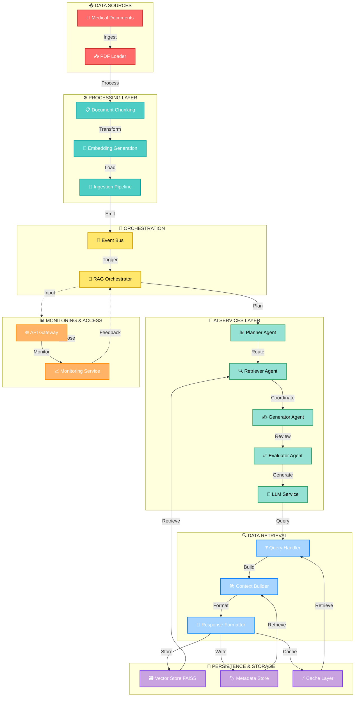

# AI Healthcare Copilot - Detailed Multi-Directional Architecture Diagram

## Overview

This detailed diagram shows the complete multi-directional flow of the AI Healthcare Copilot architecture:

### **Vertical Flows (Top-to-Bottom)**

- Data ingestion pipeline flowing downward through processing layers
- Orchestration triggering AI agents
- Response formatting and storage

### **Horizontal Flows (Left-to-Right & Right-to-Left)**

- Retriever Agent pulling from Vector Store
- Context Builder pulling from Metadata Store
- Query Handler pulling from Cache Layer
- Data retrieval flows happening in parallel

### **Feedback Loops (Dotted Lines)**

- Monitoring data flowing back to RAG Orchestrator for continuous optimization
- Real-time feedback mechanisms for system improvement

### **Color-Coded Layers**

- 🔴 **Red**: Data Sources
- 🔵 **Teal**: Processing Layer
- 🟡 **Yellow**: Orchestration
- 🟢 **Green**: AI Services
- 🔵 **Light Blue**: Data Retrieval
- 🟣 **Purple**: Persistence & Storage
- 🟠 **Orange**: Monitoring & Access

Use this diagram for detailed technical documentation and internal presentations.
