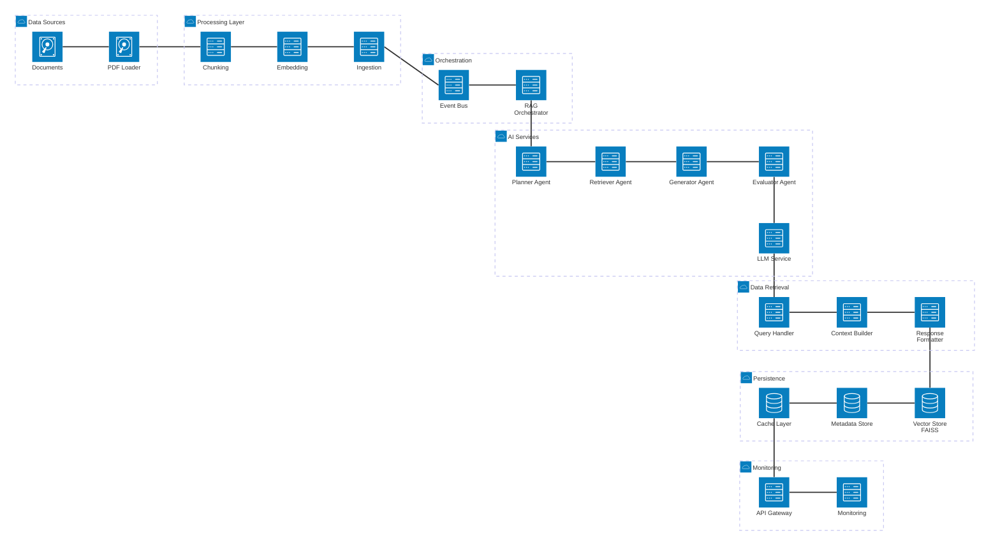

# AI Healthcare Copilot - Simple Architecture Diagram

## Overview

This diagram shows the clean, linear flow of the AI Healthcare Copilot architecture:

- **Left-to-Right Flow**: Data ingestion pipeline processing documents
- **Top-to-Bottom Flow**: Orchestration triggering AI agents and response formatting
- **Grouped Layers**: Seven distinct layers organizing components by function

Use this diagram for high-level architectural overview and presentations.
