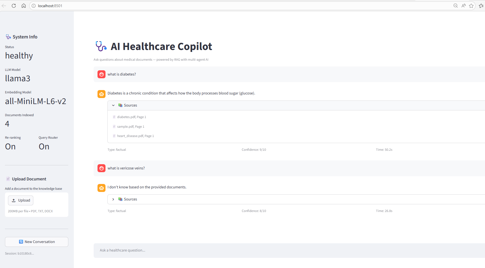

# AI Healthcare Copilot

An intelligent document-backed question-answering system powered by Retrieval-Augmented Generation (RAG) and multi-agent AI orchestration. Healthcare professionals can query medical documents using natural language and receive accurate, cited answers.



## Features

- **Multi-Agent Pipeline** — 6 specialized agents: Router, Planner, Retriever, Re-ranker, Generator, Evaluator
- **RAG with Source Citations** — every answer shows which documents and pages it came from
- **Query Routing** — classifies queries (factual, comparative, summarization) and rejects out-of-scope questions
- **Cross-Encoder Re-ranking** — improves retrieval precision by re-scoring FAISS results with a cross-encoder model
- **Conversation Memory** — session-based chat history so follow-up questions work naturally
- **Persistent Vector Store** — FAISS index saved to disk, skips re-ingestion on restart
- **Multi-Format Ingestion** — supports PDF, TXT, and DOCX documents
- **Document Upload** — add new documents at runtime via the UI or API
- **Chat UI** — Streamlit-based chat interface with message history, sources, and confidence scores
- **REST API** — FastAPI backend with auth, rate limiting, CORS, health checks
- **Centralized Configuration** — all settings via environment variables (`COPILOT_*` prefix)
- **Structured Logging** — proper Python logging with pipeline stage timing
- **Dockerized** — Docker Compose with volume persistence and environment passthrough

## Architecture

```
User Query
     |
     v
+------------------+
|  Query Router    |  Classifies: factual / comparative / summarization / out_of_scope
+------------------+
     |
     v
+------------------+
|  Planner Agent   |  Breaks query into retrieval-focused steps
+------------------+
     |
     v
+------------------+
|  Retriever Agent |  FAISS similarity search -> Cross-encoder re-ranking
+------------------+
     |
     v
+------------------+     +---------------------+
|  Generator Agent | <-- | Conversation Memory |  (session-based chat history)
+------------------+     +---------------------+
     |
     v
+------------------+
|  Evaluator Agent |  Score 0-10, Verdict: GOOD/BAD, retry if BAD
+------------------+
     |
     v
Answer + Sources + Confidence Score
```

**Data Ingestion Flow:**
```
PDF/TXT/DOCX -> Loader -> Chunker (500 tokens, 50 overlap) -> Embeddings (all-MiniLM-L6-v2) -> FAISS Index (persisted to disk)
```

## Prerequisites

- **Python 3.9+** — [Download](https://www.python.org/downloads/)
- **Ollama** with `llama3` model — [Download](https://ollama.com/)
- **Docker** (optional) — [Download](https://www.docker.com/products/docker-desktop)

**System Requirements:**
- RAM: 8GB+ recommended (LLM + embeddings + re-ranker)
- Disk: 5GB+ for models and vector index
- Internet: required for first-time model downloads

### Install Ollama and pull the model

```bash
# After installing Ollama:
ollama pull llama3
```

Ollama must be running at `http://localhost:11434` (default) before starting the app.

## Installation

### Option 1: Local Setup

```bash
# Clone the repository
git clone https://github.com/yourusername/ai-healthcare-copilot.git
cd ai-healthcare-copilot

# Create virtual environment
python -m venv venv

# Activate (Windows)
.\venv\Scripts\Activate.ps1

# Activate (macOS / Linux)
source venv/bin/activate

# Install dependencies
pip install -r requirements-backend.txt
pip install -r requirements-frontend.txt
```

### Option 2: Docker

```bash
docker compose build --no-cache
docker compose up
```

Frontend: `http://localhost:8501` | Backend API: `http://localhost:8000`

## How to Use

### 1. Add Your Medical Documents

Place PDF, TXT, or DOCX files in the `data/` folder:

```
data/
  diabetes.pdf
  heart_disease.pdf
  hypertension.pdf
  clinical_notes.txt
  treatment_guide.docx
```

### 2. Run the Application

You have three ways to use the system:

#### Option A: Web UI (Recommended)

Start the backend and frontend in separate terminals:

```bash
# Terminal 1: Backend API.
uvicorn api.app:app --host 0.0.0.0 --port 8000

# Terminal 2: Streamlit UI
streamlit run ui/app.py
```

Open `http://localhost:8501` in your browser. The chat interface lets you:
- Ask questions in natural language
- See source citations for every answer
- View confidence scores and query classification
- Upload new documents via the sidebar
- Start new conversations with the "New Conversation" button

#### Option B: Command Line

```bash
python main.py
```

This starts an interactive loop where you type questions and get answers with sources:

```
Enter your question: What are the symptoms of diabetes?

Answer:
Based on the documents, the common symptoms of diabetes include...

Sources:
  - diabetes.pdf, Page 3
  - diabetes.pdf, Page 7

Query type: factual
Confidence: 8/10
```

Type `exit` to quit.

#### Option C: REST API

```bash
# Start the API server
uvicorn api.app:app --host 0.0.0.0 --port 8000
```

Then use curl, Postman, or any HTTP client:

```bash
# Ask a question
curl -X POST http://localhost:8000/ask \
  -H "Content-Type: application/json" \
  -d '{"query": "What are the symptoms of diabetes?"}'
```

Response:
```json
{
  "answer": "Based on the documents, the common symptoms include...",
  "sources": [
    {"document": "diabetes.pdf", "page": 2},
    {"document": "diabetes.pdf", "page": 5}
  ],
  "score": 8,
  "query_type": "factual",
  "timing": {"router": 0.12, "planner": 0.45, "retriever": 0.08, "generator_attempt_1": 1.82, "evaluator": 1.05},
  "status": "success"
}
```

#### Option D: Docker

```bash
# Build and run
docker compose up --build

# Run in background
docker compose up -d

# View logs
docker compose logs -f

# Stop
docker compose down
```

### 3. Upload Documents at Runtime

You can add new documents without restarting the application:

**Via the UI:** Use the "Upload Document" section in the sidebar.

**Via the API:**
```bash
curl -X POST http://localhost:8000/upload \
  -F "file=@path/to/new_document.pdf"
```

The document is immediately chunked, embedded, and added to the vector index.

## API Reference

| Method | Endpoint | Description |
|--------|----------|-------------|
| GET | `/` | API status |
| GET | `/health` | System health (model info, document count, feature flags) |
| POST | `/ask` | Ask a question (accepts `query` and optional `session_id`) |
| POST | `/session` | Create a new conversation session |
| GET | `/session/{id}/history` | Get conversation history for a session |
| POST | `/upload` | Upload and index a new document (PDF/TXT/DOCX) |

### Conversation Sessions

To maintain context across follow-up questions:

```bash
# 1. Create a session
curl -X POST http://localhost:8000/session
# Returns: {"session_id": "abc-123-..."}

# 2. Ask with session_id
curl -X POST http://localhost:8000/ask \
  -H "Content-Type: application/json" \
  -d '{"query": "What is diabetes?", "session_id": "abc-123-..."}'

# 3. Follow-up question (remembers context)
curl -X POST http://localhost:8000/ask \
  -H "Content-Type: application/json" \
  -d '{"query": "What about its treatment?", "session_id": "abc-123-..."}'

# 4. View history
curl http://localhost:8000/session/abc-123-.../history
```

## Configuration

All settings can be overridden via environment variables with the `COPILOT_` prefix:

| Variable | Default | Description |
|----------|---------|-------------|
| `COPILOT_DATA_DIR` | `data` | Folder containing documents |
| `COPILOT_LLM_MODEL` | `llama3` | Ollama model name |
| `COPILOT_OLLAMA_BASE_URL` | `http://host.docker.internal:11434` | Ollama server URL |
| `COPILOT_CHUNK_SIZE` | `500` | Document chunk size in characters |
| `COPILOT_CHUNK_OVERLAP` | `50` | Overlap between chunks |
| `COPILOT_RETRIEVER_K` | `3` | Number of documents to retrieve |
| `COPILOT_RERANK_ENABLED` | `true` | Enable cross-encoder re-ranking |
| `COPILOT_ROUTER_ENABLED` | `true` | Enable query classification routing |
| `COPILOT_MAX_RETRIES` | `1` | Max generator retries on BAD evaluation |
| `COPILOT_API_KEY` | _(empty)_ | API key for auth (empty = no auth) |
| `COPILOT_RATE_LIMIT_PER_MINUTE` | `30` | Max API requests per minute per IP |
| `COPILOT_LOG_LEVEL` | `INFO` | Logging level (DEBUG, INFO, WARNING, ERROR) |
| `COPILOT_FORCE_REBUILD` | `false` | Force rebuild vector store on startup |

Example with environment variables:
```bash
COPILOT_LLM_MODEL=llama3.1 COPILOT_RETRIEVER_K=5 COPILOT_LOG_LEVEL=DEBUG python main.py
```

Or create a `.env` file:
```env
COPILOT_LLM_MODEL=llama3
COPILOT_OLLAMA_BASE_URL=http://localhost:11434
COPILOT_API_KEY=my-secret-key
COPILOT_LOG_LEVEL=INFO
```

## Project Structure

```
ai-healthcare-copilot/
├── main.py                        # CLI entry point
├── config.py                      # Centralized settings (env var overrides)
├── logging_config.py              # Structured logging + pipeline timer
├── requirements-backend.txt       # Backend dependencies
├── requirements-frontend.txt      # Frontend dependencies
├── docker-compose.yml             # Container orchestration
├── Dockerfile.backend             # Backend container
├── Dockerfile.frontend            # Frontend container
│
├── agents/                        # AI Agent modules
│   ├── llm.py                    # LLM service wrapper (Ollama)
│   ├── router.py                 # Query classification & routing
│   ├── planner.py                # Query planning
│   ├── retriever.py              # Document retrieval + source citations
│   ├── reranker.py               # Cross-encoder re-ranking
│   ├── generator.py              # Answer generation (with chat history)
│   └── evaluator.py              # Answer quality evaluation
│
├── pipeline/                      # Orchestration
│   └── rag_pipeline.py           # Full RAG pipeline coordination
│
├── memory/                        # Conversation state
│   └── conversation.py           # Session-based chat history
│
├── ingestion/                     # Data processing
│   ├── loader.py                 # Multi-format document loading
│   ├── chunking.py               # Text chunking
│   └── embedding.py              # Embedding generation
│
├── vector_store/                  # Vector database
│   ├── faiss_db.py               # FAISS create/save/load/merge
│   └── index/                    # Persisted FAISS index (auto-generated)
│
├── api/                           # REST API
│   └── app.py                    # FastAPI with auth, rate limiting, CORS
│
├── ui/                            # Web frontend
│   └── app.py                    # Streamlit chat interface
│
└── data/                          # Document storage
    ├── diabetes.pdf
    ├── heart_disease.pdf
    ├── hypertension.pdf
    └── sample.pdf
```

## Troubleshooting

**Ollama not running:**
```
Connection refused to http://localhost:11434
```
Start Ollama: `ollama serve` and ensure `llama3` is pulled: `ollama pull llama3`

**For local development**, change the Ollama URL:
```bash
COPILOT_OLLAMA_BASE_URL=http://localhost:11434 python main.py
```
The default `host.docker.internal` is for Docker. Locally, use `localhost`.

**Port already in use:**
```bash
uvicorn api.app:app --port 8001
streamlit run ui/app.py --server.port 8502
```

**FAISS index stale after changing documents:**
```bash
COPILOT_FORCE_REBUILD=true python main.py
```

**Virtual environment activation (Windows PowerShell):**
```powershell
Set-ExecutionPolicy -ExecutionPolicy RemoteSigned -Scope CurrentUser
.\venv\Scripts\Activate.ps1
```

**Out of memory:** Disable re-ranking (most memory-hungry component):
```bash
COPILOT_RERANK_ENABLED=false python main.py
```

## Tech Stack

| Component | Technology |
|-----------|------------|
| LLM | Ollama (Llama3) via LangChain |
| Embeddings | HuggingFace all-MiniLM-L6-v2 |
| Re-ranking | sentence-transformers CrossEncoder |
| Vector Store | FAISS (Facebook AI Similarity Search) |
| Backend | FastAPI + Uvicorn |
| Frontend | Streamlit |
| Auth | API key header (X-API-Key) |
| Rate Limiting | SlowAPI |
| Containers | Docker + Docker Compose |

## Documentation

- [RAG Explained — What, Why, and Use Cases](docs/RAG-EXPLAINED.md) — Deep dive into what RAG is, why it's used instead of plain LLMs, comparison with alternatives, and real-world use cases in healthcare and education.

## Author

**Deepak Lokanath**
